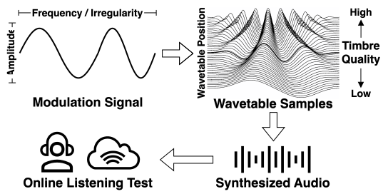

<h1>Do Audio Distance Functions Hear Timbre Modulation? A Machine Listening Study</h1>

    <a href="https://christhetr.ee/" target=”_blank”>Christopher Mitcheltree</a>,
    <a href="https://www.linkedin.com/in/sachin-subramanian-642742212/" target=”_blank”>Sachin Subramanian</a>,
    <a href="https://www.qmul.ac.uk/eecs/people/profiles/pauwelsjohan.html" target=”_blank”>Johan Pauwels</a>,
    <a href="https://joshreiss.github.io/" target=”_blank”>Joshua D. Reiss</a>, and
    <a href="https://iranroman.github.io/" target=”_blank”>Iran R. Roman</a>

<h2>Abstract</h2>

Audio distance functions are widely used in deep inverse audio problems like sound matching, yet their alignment with human perception of dynamic timbre modulation remains uncharacterized.
In light of this, we conduct a MUSHRA-style listening test with 54 participants evaluating human sensitivity to modulation amplitude, frequency, and irregularity across warmth, brightness, and richness timbre qualities using wavetable synthesis.
Listeners demonstrate robust perceptual invariance to underlying timbre and wavetable source, with perceived difference scaling linearly with modulation amount.
We then evaluate nine audio distance functions across STFT-based, wavelet-based, and neural representations using linear regression, variance decomposition, and correlation with human ratings.
Wavelet scattering transforms provide the most consistent alignment with human perception across modulation types, while STFT-based methods fail to resolve modulation frequency, and neural methods exhibit fragmented, embedding dependent competencies.
Our findings offer empirical evidence to guide the principled selection and design of perceptually grounded loss functions for deep inverse problems involving modulated audio.
We make our code, audio samples, and listening test data available.

    
    
Figure 1: <em>A modulation signal can vary in amplitude, frequency, and irregularity to scan through a wavetable that spans a range of timbre qualities. The resulting audio stimulus was rated by listeners for perceived difference from a minimally modulated reference.</em>

<h2>Instructions for Reproducibility</h2>

<ol>
    <li>Clone this repository recursively with submodules and open its directory:
     <code>git clone --recurse-submodules https://github.com/christhetree/mod_perception.git</code>
     <code>cd mod_perception</code>
    </li>
    <li>
    Install dependencies using <code>uv</code>:
     <code>uv sync</code>
     <code>source .venv/bin/activate</code>
    </li>
    <li>The source code can be explored in the <code>src/</code> directory.</li>
    <li>All listening test responses, wavetables, and script outputs are located in the <code>data/</code> directory.</li>
    <li>Create an output directory (<code>mkdir out</code>).</li>
    <li>
    Ensure your <code>PYTHONPATH</code> includes <code>src/</code> and the <code>kymatio</code> submodule:
     <code>export PYTHONPATH=$PYTHONPATH:$(pwd)/src:$(pwd)/kymatio</code>
    </li>
    <li>
    Run the data synthesis and analysis pipeline in sequential order:
    <ul>
        <li><code>python scripts/0_make_synthetic_wavetables.py</code> (synthesize warmth, brightness, and richness wavetables)</li>
        <li><code>python scripts/1_calc_wavetable_linear_luts.py</code> (calculate linearizing lookup tables for each wavetable)</li>
        <li><code>python scripts/2_make_stimuli.py</code> (generate the 90 audio stimuli for the listening test)</li>
        <li><code>python scripts/3_postprocess_listening_test_data.py</code> (filter and post-process MUSHRA listening test responses)</li>
        <li><code>python scripts/4_calc_anovas_listening_test.py</code> (compute multi-way ANOVAs on listener ratings)</li>
        <li><code>python scripts/5_calc_audio_distances.py</code> (evaluate 9 audio distance functions across stimuli)</li>
        <li><code>python scripts/6_calc_variance_decomposition.py</code> (perform variance decomposition)</li>
        <li><code>python scripts/7_calc_noise_ceiling.py</code> (compute group and individual noise ceilings for human ratings)</li>
        <li><code>python scripts/8_calc_correlation.py</code> (calculate correlations between distance functions and human perception)</li>
    </ul>
    </li>
    <li>
    Generate paper figures and tables using the scripts in <code>scripts/assets/</code>:
    <ul>
        <li><code>python scripts/assets/fig_opt_wavetables.py</code> (wavetable visualization and feature range analysis)</li>
        <li><code>python scripts/assets/fig2_linear_regression.py</code> (linear regression plots)</li>
        <li><code>python scripts/assets/fig3_variance_decomposition.py</code> (variance decomposition bar plots)</li>
        <li><code>python scripts/assets/tab1_linear_regression.py</code> (linear regression results table)</li>
        <li><code>python scripts/assets/tab2_correlation.py</code> (correlation results table)</li>
        <li><code>python scripts/assets/tab_opt_correlation_all.py</code> (extended correlation results table)</li>
    </ul>
    </li>
    <li>
    The complementary website source code can be explored in the <code>docs/</code> directory or viewed online at <a href="https://christhetree.github.io/mod_perception/" target="_blank">https://christhetree.github.io/mod_perception/</a>.
    </li>
    <li>
    Don't hesitate to open an issue if you have any questions or comments.
    </li>
</ol>

<h2>AI Usage Statement</h2>

AI coding assistants (Gemini Flash 3.7 and 3.8) were used during the development of the research codebase and for generating figures and tables. 
All AI-generated code was subject to human verification to ensure correctness. 
The paper was fully written by the authors and then edited with the aid of an LLM to improve conciseness.

